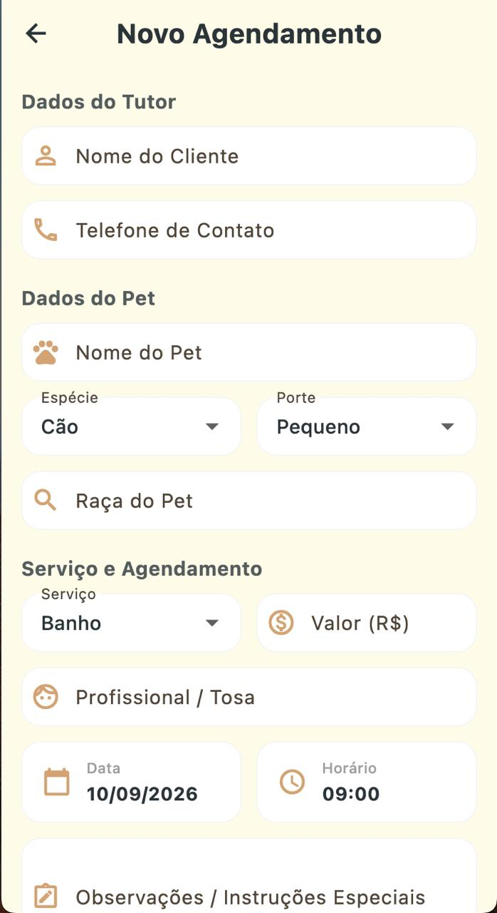

# Pet Shower Control

Aplicativo multiplataforma para controle de agendamentos de banho e outros
servicos em um petshop. A aplicacao centraliza a agenda do dia, os dados dos
tutores e dos pets, o acompanhamento do atendimento e um resumo financeiro.

## Objetivo do aplicativo

Facilitar a organizacao da rotina do petshop, permitindo cadastrar e consultar
agendamentos em poucos passos. O aplicativo ajuda a equipe a acompanhar cada
atendimento desde a chegada do pet ate a entrega, reduzindo o uso de controles
manuais e melhorando a visualizacao da agenda.

## Tema e dominio

O projeto pertence ao dominio de gestao de servicos para animais de estimacao,
com foco em banho, tosa e cuidados de higiene em petshops. O publico principal
sao os profissionais responsaveis pela recepcao, organizacao da agenda e
execucao dos atendimentos.

## Funcionalidades atuais

- Criacao de agendamentos com dados do tutor, telefone, pet, especie, raca e porte.
- Selecao do servico, profissional responsavel, data, horario, preco e observacoes.
- Edicao e exclusao de agendamentos.
- Alteracao do status do atendimento: `Aguardando`, `Em Banho`, `Pronto` e `Entregue`.
- Visualizacao da agenda por data, com navegacao entre dias proximos.
- Filtro dos agendamentos por status.
- Metricas diarias de atendimentos aguardando, em banho, prontos e entregues.
- Ordenacao automatica dos agendamentos por data e horario.
- Persistencia local dos dados em arquivo JSON no diretorio de documentos do dispositivo.
- Relatorio com faturamento realizado, pendente e total historico.
- Distribuicao dos servicos cadastrados e diretorio de clientes.
- Validacao de campos obrigatorios e formatacao de nomes e telefone.

## Tecnologias utilizadas

- **Flutter e Dart**: desenvolvimento da aplicacao multiplataforma.
- **Material 3**: componentes e tema visual da interface.
- **Provider**: gerenciamento do estado dos agendamentos.
- **path_provider**: acesso ao diretorio local de documentos do dispositivo.
- **JSON**: serializacao e persistencia local dos agendamentos.
- **intl**: formatacao de datas e inicializacao da localizacao em portugues do Brasil.

## Como executar o projeto

### Pre-requisitos

- Flutter SDK compativel com o Dart `3.12.0` ou superior.
- Um dispositivo, emulador Android/iOS ou desktop compativel com Flutter.
- Flutter configurado no `PATH`.

### Passos

1. Clone ou abra este repositorio.
2. No diretorio raiz do projeto, instale as dependencias:

	```bash
	flutter pub get
	```

3. Verifique os dispositivos disponiveis:

	```bash
	flutter devices
	```

4. Execute o aplicativo:

	```bash
	flutter run
	```

Para validar o projeto antes da execucao, utilize:

```bash
flutter analyze
```

## Screenshots

As imagens abaixo apresentam as principais telas do aplicativo de agendamento
de banho para petshop.

### Tela inicial

Agenda diaria com os agendamentos, seletor de data, metricas e filtros por
status.


### Cadastro de agendamento

Formulario para cadastrar os dados do tutor, do pet, do servico, do horario e
do atendimento.



### Resumo financeiro

Visualizacao do faturamento realizado, dos valores pendentes e do total
historico.


### Exclusao de agendamento

Dialogo de confirmacao exibido antes da exclusao de um agendamento.


## Proximas evolucoes previstas

- Sincronizacao dos agendamentos com um backend ou banco de dados em nuvem.
- Login e controle de acesso para diferentes perfis da equipe.
- Notificacoes e lembretes para tutores e profissionais.
- Integracao com calendario e envio de confirmacoes por WhatsApp ou SMS.
- Cadastro separado de clientes, pets, servicos e profissionais.
- Relatorios com filtros por periodo, servico e profissional.
- Exportacao de relatorios e backup dos dados.
- Integracao com telefonia para iniciar chamadas diretamente pelo diretorio de clientes.
