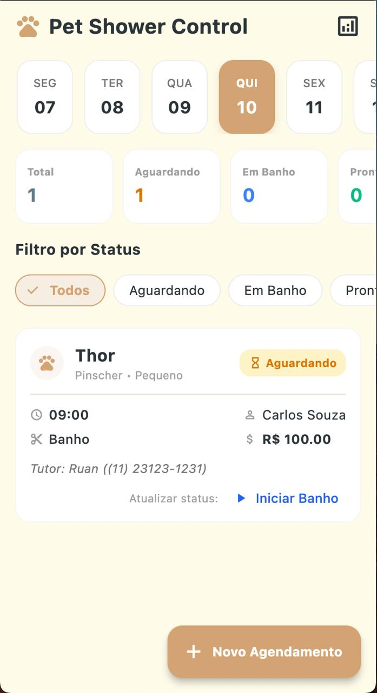
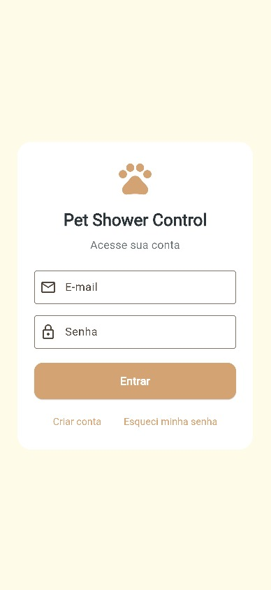
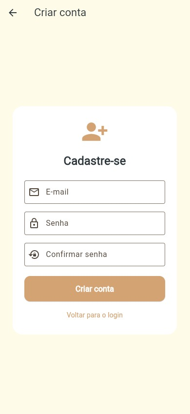
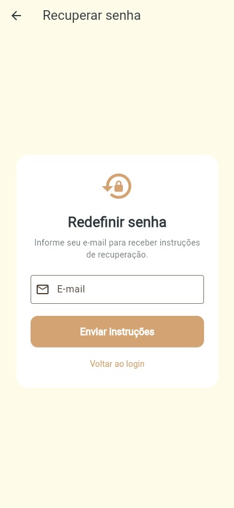
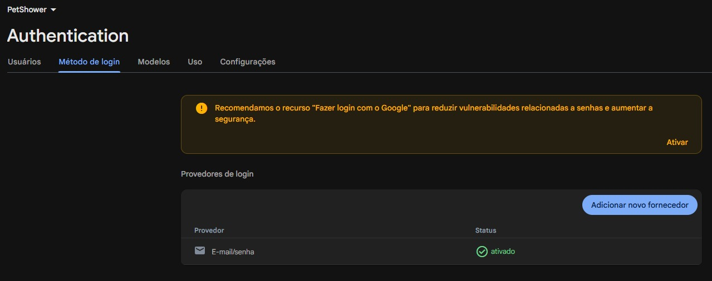
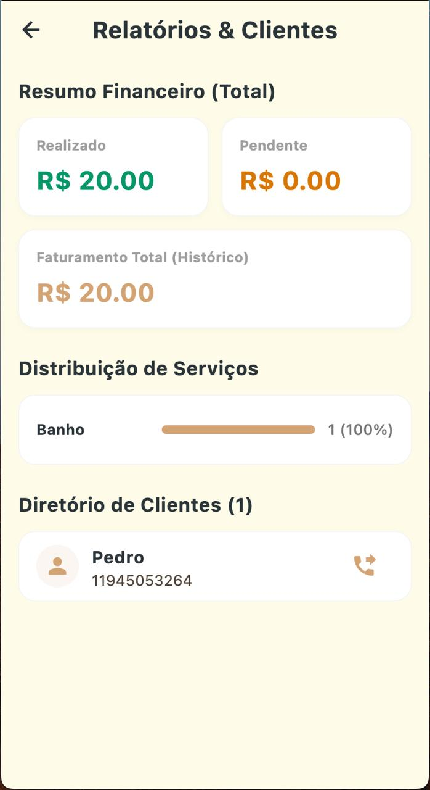
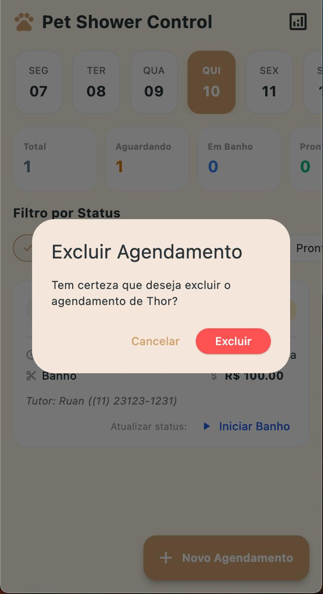

# Pet Shower Control

Aplicativo multiplataforma para controle de agendamentos de banho e outros
serviços em um petshop. O sistema centraliza a agenda do dia, os dados dos
tutores e dos pets, o acompanhamento do atendimento e o resumo financeiro da
rotina do estabelecimento.

## Objetivo do aplicativo

Facilitar a organização da rotina do petshop, permitindo cadastrar e consultar
agendamentos com agilidade, acompanhar o status de cada atendimento e manter a
visão geral da operação em um único local.

## Tema e domínio

O projeto pertence ao domínio de gestão de serviços para animais de estimação,
com foco em banho, tosa e cuidados de higiene em petshops. O público principal
são os profissionais responsáveis pela recepção, organização da agenda e
execução dos atendimentos.

## Funcionalidades implementadas do Trabalho 1

- Cadastro de agendamentos com dados do tutor, telefone, pet, espécie, raça e porte.
- Seleção de serviço, profissional, data, horário, preço e observações.
- Edição e exclusão de agendamentos.
- Alteração do status do atendimento: `Aguardando`, `Em Banho`, `Pronto` e `Entregue`.
- Visualização da agenda por data, com navegação entre dias próximos.
- Filtro dos agendamentos por status.
- Métricas diárias de atendimentos aguardando, em banho, prontos e entregues.
- Ordenação automática dos agendamentos por data e horário.
- Persistência local dos dados em arquivo JSON no diretório de documentos do dispositivo.
- Relatório com faturamento realizado, pendente e total histórico.
- Distribuição dos serviços cadastrados e diretório de clientes.
- Validação de campos obrigatórios e formatação de nomes e telefone.

## Nova seção: autenticação com Firebase

Foi adicionada a camada de autenticação do Trabalho 2 utilizando Firebase Authentication.

### Funcionalidades implementadas

- Cadastro de usuário com e-mail e senha.
- Login com e-mail e senha.
- Recuperação de senha por e-mail.
- Logout da sessão atual.
- Verificação automática do estado de autenticação ao abrir o app.
- Proteção das telas internas para usuários não autenticados.
- Mensagens amigáveis para erros comuns de autenticação.

## Tecnologias utilizadas

- **Flutter + Dart**: desenvolvimento da aplicação multiplataforma.
- **Firebase Core**: inicialização do projeto Firebase.
- **Firebase Authentication**: autenticação por e-mail e senha.
- **Material 3**: interface visual da aplicação.
- **Provider**: gerenciamento do estado dos agendamentos.
- **path_provider**: acesso ao diretório local do dispositivo.
- **JSON**: persistência local dos dados.
- **intl**: formatação de datas e localização em português do Brasil.

## Estrutura resumida do projeto

```text
lib/
├── main.dart
├── firebase_options.dart
├── models/
│   └── appointment_model.dart
├── providers/
│   └── appointment_provider.dart
├── screens/
│   ├── auth_gate.dart
│   ├── login_screen.dart
│   ├── register_screen.dart
│   ├── forgot_password_screen.dart
│   ├── home_screen.dart
│   ├── add_appointment_screen.dart
│   └── reports_screen.dart
├── services/
│   ├── auth_service.dart
│   └── storage_service.dart
└──
```

## Como executar/configurar o projeto

### Pré-requisitos

- Flutter SDK compatível com Dart `3.12.0` ou superior.
- Firebase configurado no projeto.
- Dispositivo, emulador Android ou navegador com suporte ao Flutter.
- Provedor `Email/Password` habilitado no Firebase Console.

### Passos

1. Clone ou abra este repositório.
2. Instale as dependências:

```bash
flutter pub get
```

3. Verifique os dispositivos disponíveis:

```bash
flutter devices
```

4. Configure o projeto Firebase no console e confirme que o arquivo `lib/firebase_options.dart` esteja presente.
5. Habilite o provedor de autenticação:
   - Acesse o Firebase Console;
   - Abra o projeto;
   - Vá em `Authentication`;
   - Selecione `Sign-in method`;
   - Ative `Email/Password`.
6. Execute a aplicação:

```bash
flutter run
```

### Verificação adicional

```bash
flutter analyze
```

## Fluxo de autenticação

- Usuário autenticado: acesso direto à área interna do Trabalho 1.
- Usuário não autenticado: visualiza a tela de login.
- Login inválido: mensagem amigável sem expor detalhes do Firebase.
- Cadastro com e-mail já existente: mensagem amigável e tratada no app.
- Recuperação de senha: envio de instruções sem revelar se a conta existe.
- Logout: encerra a sessão e retorna ao fluxo de autenticação.

## Screenshots

Os screenshots abaixo representam as telas principais do app e devem ser
adicionados conforme disponibilizados na execução do projeto.

### Tela inicial



### Tela de login



### Tela de criar conta



### Tela de redefinir senha



### Configuração do Firebase Console



### Resumo financeiro



### Modal de exclusão



## Próximas evoluções previstas para o Trabalho 3

- Integração com banco de dados em nuvem ou Firebase Firestore.
- Sincronização dos agendamentos entre dispositivos e usuários autenticados.
- Controle de acesso por perfis e permissões de usuários.
- Notificações e lembretes para clientes e equipe.
- Cadastro separado de clientes, pets, serviços e profissionais.
- Relatórios mais avançados com filtros por período, tipo de serviço e profissional.
- Exportação de dados e backups de agenda.
- Melhorias na usabilidade e automações da rotina do petshop.

- Sincronizacao dos agendamentos com um backend ou banco de dados em nuvem.
- Login e controle de acesso para diferentes perfis da equipe.
- Notificacoes e lembretes para tutores e profissionais.
- Integracao com calendario e envio de confirmacoes por WhatsApp ou SMS.
- Cadastro separado de clientes, pets, servicos e profissionais.
- Relatorios com filtros por periodo, servico e profissional.
- Exportacao de relatorios e backup dos dados.
- Integracao com telefonia para iniciar chamadas diretamente pelo diretorio de clientes.
